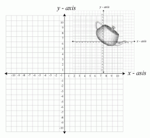

.. _transforms:

Transform Spaces
****************

.. contents::
   :maxdepth: 2

.. seealso::

    :ref:`api_transform_spaces`

Co-ordinate Systems
===================

World Space
-----------

The World Space co-ordinate system is the global co-ordinate system in which all objects are located.

When using World Space, we are describing objects in terms of the global origin.

.. seealso::

    :ref:`api_inertial_space`

Local Space
-----------

Local Space co-ordinate systems are relative to another object.

Using Local Space simplify the management and upkeep of 3D objects because we can specify them relative to another object.

Example
-------

Image you have two 3D objects: a Soldier object, and a Gun object.

The Soldier and Gun are placed using co-ordinates in World Space.

If the Soldier picks the gun up, how do we keep the Gun positioned on the Soldier's body?

We can use World Space co-ordinates to place the Gun.
To do this we need to know the Soldier's position and the position relative to the Soldier to place the gun.
If the Soldier moves, we must re-calculate this value.

Or we could position the Gun using a Local Space co-ordinate system relative to the Soldier.
Using this, we only need to know the position relative to the Soldier to place the gun.
If the Soldier moves, we don't need to re-calculate anything because the Gun is relative to the Soldier and will move with it.

Transforms
==========

Manipulation of 3D spaces is performed through the use of Transform classes.
These provide access to common functions related to translation and orientation of objects in 3D space.

PyGLy provides two types of Transform classes: Transform, and WorldTransform.
These objects differ in the co-ordinate systems the functions manipulate.

The Transform class implements Local Space manipulations.
Modifications done using the Transform class are performed with no understanding of World Space.
When used outside of a hierarchy, the Transform space is relative to World Space.
When used inside a hierarchy, the Transform space is relative to the parent's Local Space.

The WorldTransform class implements World Space manipulations.
A WorldTransform object is linked to a Transform object.
Modifications done using the WorldTransform class are performed in World Space.
This can be used to set absolute positioning of an object despite it's parent's transform.

The WorldTransform class implements the TreeNode class which adds the concept of a hierarchy.
WorldTransforms can be joined together in a Parent - Child tree (1 parent maximum). This enables the inheritance of parent transforms.

Usage of WorldTransform or Transform objects is not mutually exclusive. Modifications performed on the WorldTransform or the linked Transform object are propagated to each other.

Transform Spaces
================

Each Transform class exposes two co-ordinate spaces, Object Space, and Inertial Space.

When using Object Space, the X,Y and Z axis inherit the orientation from the Object.
As the Object's orientation changes, the X,Y and Z axis presented by functions change accordingly.

When using Inertial Space, the X,Y and Z axis remain fixed regardless of the Object's orientation.

Object Space
------------

The Object Space co-ordinate system's axis are fixed to the object's orientation.
As the object is rotated, the Object Space axis will change with the object.

.. figure:: _static/transform_object_space.png
   :align:  center

   *Object Transform Space.*

.. seealso::

    :ref:`api_object_space`

Inertial Space
--------------

The Inertial Space co-ordinate system orientation is relative to it's parent orientation.
When there is no parent, the co-ordinate system is the same as the global World Space.
The Inertial Space axis does not change when the object is rotated.

   *Inertial Transform Space*

.. seealso::

    :ref:`api_inertial_space`

